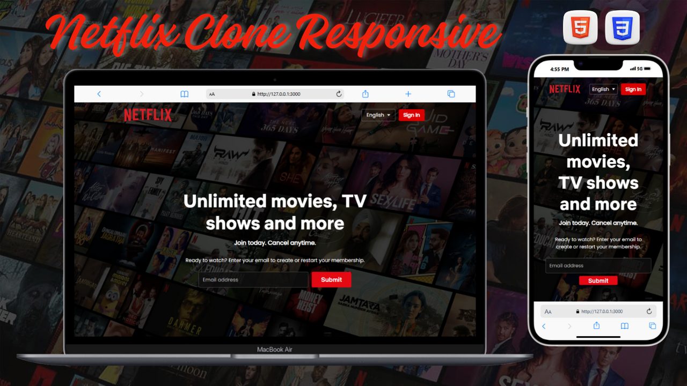

# 🎬 Netflix Clone Lite

A modern **Netflix-style landing page** designed using HTML and CSS to sharpen my front-end skills through hands-on practice. This project focuses on layout design, interactivity, and responsiveness using only HTML and CSS.

---

## 🌐 Live Demo

---

## 🚀 Features

- 🎨 Netflix-inspired dark theme and red accent color scheme  
- 📱 Fully responsive layout for both desktop and mobile  
- 🖼️ Hero section with promotional text and call-to-action buttons  
- ✨ Smooth **hover effects** and **CSS transitions** for interactive UI  
- ⚡ Clean, modern, and minimal streaming-style design

---

## 🛠️ Built With

- **HTML5**  
- **CSS3** (includes transitions and hover animations)

---

## 📚 Purpose

This project was built to practice and strengthen my front-end development skills. The goal was to recreate a visually appealing **Netflix-inspired** landing page layout while focusing on responsive design and CSS styling techniques.

---

## 💻 Source Code

[🔗 GitHub Repository](https://github.com/nufail-01/netflix-lite-project.git)
